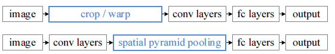
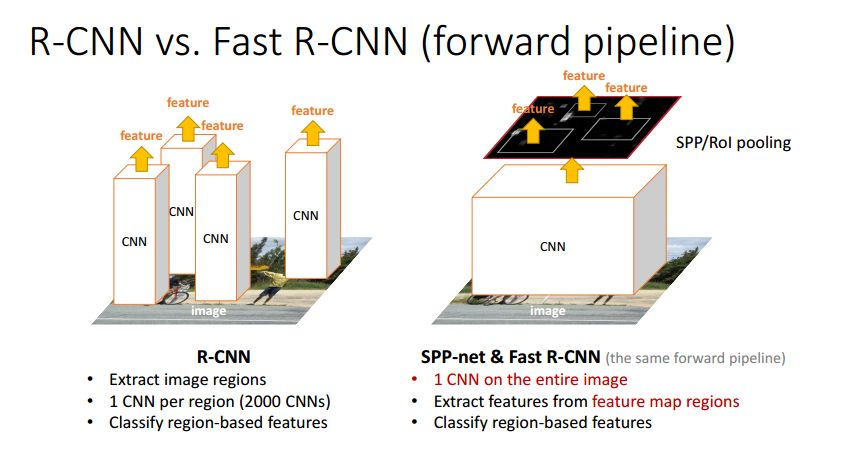

## fast-RCNN

fast-RCNN是RCNN模型的变种，其性能更佳。
#### 背景：
R-CNN 是region convolutional neural network的简称。

RCNN有不错的效果，但是运行的性能不行。其中有一部分原因是：RCNN的框架根据region proposal 对input image 进行crop和warp，并将处理后的roi都feed进CNN中，这样有多个ROI时，就需要多次运行CNN的全流程，这样导致了重复的运算。

#### 创新点

- [x] 对input images 使用统一的CNN，只进行一次CNN流程，在得到的feature map上进行ROI的提取，将提取后的ROI用于后处理。从而达到加速的目的

- [x] 使用Spatial pyramid pooling networks的结构保证了进行ROI提取后的feature map 具有相同的shape，保证可以将提取出的feature map 统一的进行后续的处理。

  - [x] 通过将每一个feature map进行grid分割，并进行Max pooling。因为进行分割的grid是可以指定的，这样就相当于通过pooling的手段调整了feature map的shape。

  - [x] 对feature maps 进行不同的分割--1x1，2x2， 3x3，处理后将得到的feature maps展开并拼接。feed into the next layer。

    

    **Comparison between R-CNN and Fast R-CNN**

    

    

- [x] 将原本的多阶段任务进行了整合，在fast rcnn中，将出了region proposal以为的任务都**整合到一个网络**中进行训练和推理。构造了一个multi-tasks network

#### architecture

#### reference

- [x] [original paper](https://arxiv.org/pdf/1506.01497.pdf)

- [x] [fast rcnn 知乎](https://zhuanlan.zhihu.com/p/24780395)

- [ ] [RCNN family](https://blog.csdn.net/xyy19920105/article/details/50817725)

- [ ] [RCNN family 1](https://closure11.com/rcnn-fast-rcnn-faster-rcnn%E7%9A%84%E4%B8%80%E4%BA%9B%E4%BA%8B/)

